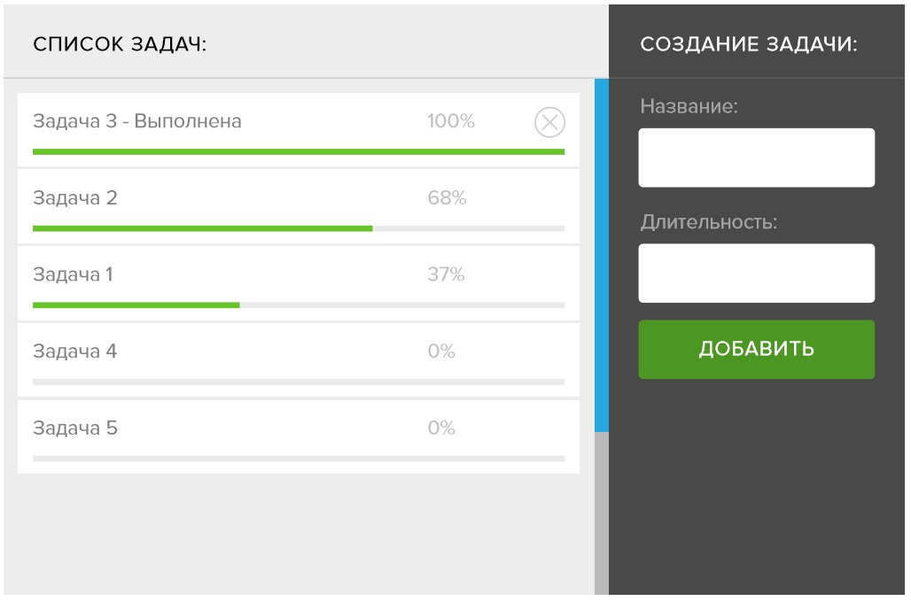
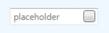

# Тестовое задание WPF

1. Написать приложение используя принципы MVVM   

    Программа должна состоять из одной формы, в которой слева необходимо разместить область отобржения списка зада (названия и прогресса выполнения), а справа область для их создания. Создаваемая задача будет выполнять псевдо-работу после чего завершаться. Время выполнения и название задачи пользователь может указывать при её создании. После завершения у задачи в списке будет появляться кнопка для исключения задачи из списка.

    - Отображаемый список задач должен динамически сортироваться по проценту выполненной работы
     
    - Интерфейс должен корректно отображаться при изменении размеров окна
    
    - В поле длительность можно ввести только числовое значение в секундах (либо не давать пользователю ввести неправльные данные, либо подсвечивать невалидное поле и деактивировать кнопку "добавить")
    
    - Необходио стилизовать все элементы управления согласно представленному макету

    

2. Расширить функционал элемента управления **TextBox**
   
   - Добавить **PlaceHolder** (Текст отображаемый, когда поле ввода пустое, а так же его нельзя редактировать или выделять)
  
   - Добавить возможность размещать дополнительное содержимое справа (допустим вариант через наследование от базового класса или через использование прикрепляемых поведений (**Behaviors**))
  
    - Несчитая дополнений внешний вид оставить по-умолчанию
   
    Пример с наследование от **TextBox**:
    ```xml
    <customs:TextBox PlaceHolder="placeholder">
        <custom:TextBox.RightContent>
            <Button/>
        </custom:TextBox.RightContent>
    </custom:TextBox>
    ```
    
    

___

Требования для сборки: .Net Framework 4.7.1, MS Visual Studio 2017